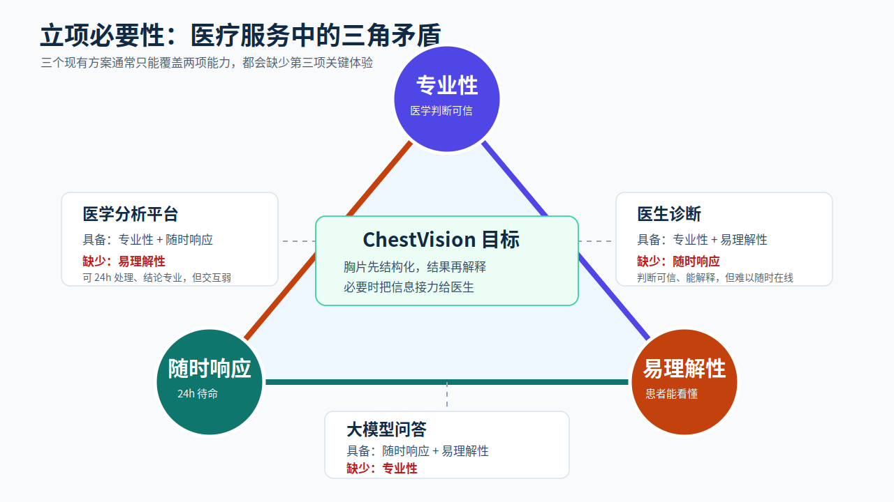
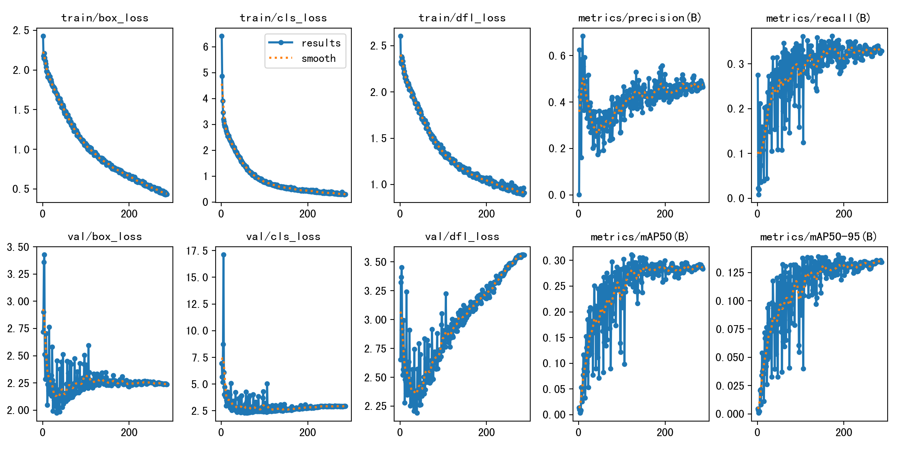
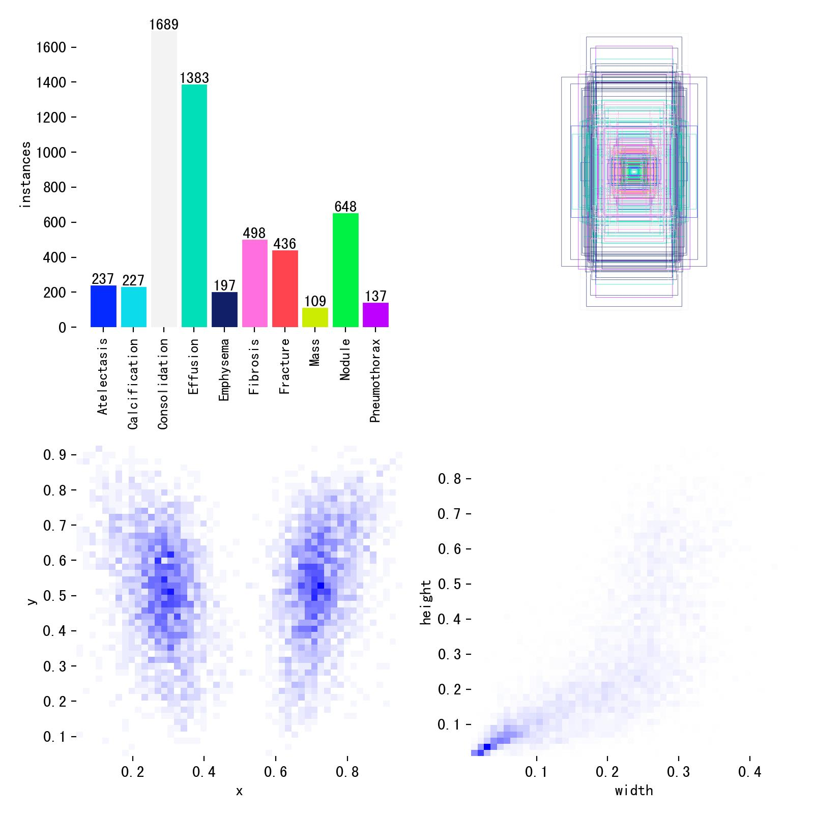

# ChestVision 项目汇报 PPT 大纲

> 版本：outline draft  
> 页数：9 页  
> 页面比例：16:9  
> 生成原则：图片优先承载信息，文字只保留标题、结论和必要标签。

## Slide 1: 标题页

- Title: ChestVision 胸部 X 光片智能辅助分析系统
- Key points:
  - 胸片检测
  - 智能对话
  - 医患协同
- Visual idea: 左侧标题与关键词，右侧生成胸片 AI 检测示意图作为视觉主图。
- Layout role and intent: cover；快速建立“胸片 + AI 标注”的项目印象。
- Required images:
  - No strict input image. Generate from `../image_generation_prompts/slide_01_cover.md`.

## Slide 2: 立项背景与必要性

- Title: 专业性、随时响应、易理解性之间的三角矛盾
- Key points:
  - 胸片检查高频，阅片与沟通成本高
  - ChestVision 的目标是在三者之间建立连接
- Visual idea: 使用三角矛盾图作为页面主体。
- Layout role and intent: context/problem；解释为什么需要这个系统。
- Required images:
  - 三角矛盾图；strict input asset；完整展示三类方案与能力缺口，不能改写关键文字。

    

## Slide 3: 需求分析与利益相关方

- Title: 需求如何落到系统功能
- Key points:
  - 患者、医生、管理员三类角色
  - 模型对话、推理管理、训练与模型管理三类模块
- Visual idea: 生成需求-功能-价值适配图作为主体。
- Layout role and intent: concept explanation；展示需求推导和功能映射。
- Required images:
  - No strict input image. Generate from `../image_generation_prompts/slide_03_demand_fit.md`.

## Slide 4: 技术架构图

- Title: 技术组件如何组合成整体平台
- Key points:
  - 仅展示技术架构，不展开讲解
- Visual idea: 生成技术架构图，全屏或近全屏展示。
- Layout role and intent: architecture；展示技术组件、模块构成与整体能力之间的关系。
- Required images:
  - No strict input image. Generate from `../image_generation_prompts/slide_04_system_architecture.md`.

## Slide 5: 推理检测与模型训练结果

- Title: YOLOv11 胸片检测与训练表现
- Key points:
  - 检测 10 类胸部病变
  - 类别不均衡限制了部分类别训练效果
- Visual idea: 生成两张数据可视化图片：训练指标趋势图、数据集类别分布图。
- Layout role and intent: data evidence；用训练图和类别分布解释模型表现与限制。
- Required images:
  - YOLO 训练评估结果图；reference input asset；用于 `../image_generation_prompts/slide_05_yolo_training_results.md`，需保留主要指标趋势和相对变化。

    

  - 数据集标签分布结果图；reference input asset；用于 `../image_generation_prompts/slide_05_dataset_distribution.md`，需保留类别不均衡和标注分布信息。

    

## Slide 6: 多 Agent 智能对话

- Title: 先判断问题，再交给对应能力处理
- Key points:
  - 规则路由保证常见问题响应快
  - LLM 兜底处理复杂表达
- Visual idea: 生成多 Agent 流程图作为主体。
- Layout role and intent: process；展示用户输入到路由、专业节点和最终回复的流程。
- Required images:
  - No strict input image. Generate from `../image_generation_prompts/slide_06_multi_agent_flow.md`.

## Slide 7: 医患协同

- Title: 让检测结果进入医患协同流程
- Key points:
  - 管理员分配医患关系
  - 医生管理病例与检测历史
  - 系统推荐适合接力处理的医生
- Visual idea: 生成一张横向流程图：患者上传胸片 → AI 检测 → 医生推荐 → 管理员确认 → 医生接诊。
- Layout role and intent: process/collaboration；强调 AI 初筛之后进入医生接力，而不是停在检测结果。
- Required images:
  - No strict input image. Generate from `../image_generation_prompts/slide_07_medical_collaboration.md`.

## Slide 8: 模型迭代

- Title: 训练、登记、切换形成模型迭代闭环
- Key points:
  - OSS 分片上传支持大文件数据集
  - PAI-DLC 执行云上容器训练
  - 模型版本登记后可切换默认推理模型
- Visual idea: 生成闭环流程图：数据集上传 → 远程训练 → 产物校验 → 模型版本登记 → 默认模型切换。
- Layout role and intent: process/timeline；说明模型能力如何持续更新。
- Required images:
  - No strict input image. Generate from `../image_generation_prompts/slide_08_model_iteration.md`.

## Slide 9: 创新点与总结

- Title: 从病灶识别到信息接力
- Key points:
  - 规则路由 + LLM 路由：兼顾速度和理解能力
  - 检测结果 + 病史 + 对话上下文：提升分析贴近度
  - 医生推荐 + 管理员审核：降低信息交接成本
  - 云上训练 + 模型版本管理：支持持续迭代
- Visual idea: 生成四象限总结图，四个象限分别为检测、解释、协同、迭代。
- Layout role and intent: summary；把技术创新收束成完整闭环。
- Required images:
  - No strict input image. Generate from `../image_generation_prompts/slide_09_innovation_summary.md`.
