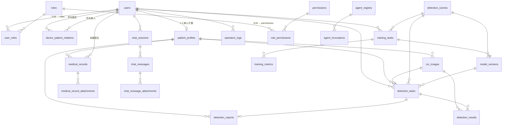

# 胸片 X 光多智能体分析系统 — 数据库设计文档（v3.0）

> 项目：基于 YOLOv11 的胸部 X 光多 Agent 智能诊断平台  
> 版本：v3.0（医患角色 + 病例管理 + 多 Agent 协作）  
> 日期：2026-07-14  
> 数据库：PostgreSQL 15 + Pgvector  
> ORM：SQLAlchemy 2.0

---

## 目录

- [一、需求变更说明](#一需求变更说明)
- [二、表结构总览](#二表结构总览)
- [三、ER 实体关系图](#三er-实体关系图)
- [四、模块一：用户与角色（重构）— 6 张表](#四模块一用户与角色重构-6-张表)
- [五、模块二：检测业务 — 3 张表](#五模块二检测业务-3-张表)
- [六、模块三：模型管理 — 3 张表](#六模块三模型管理-3-张表)
- [七、模块四：智能体对话 — 3 张表](#七模块四智能体对话-3-张表)
- [八、模块五：多 Agent 管理 — 3 张表](#八模块五多-agent-管理-3-张表)
- [九、模块六：患者与病例 — 5 张表](#九模块六患者与病例-5-张表)
- [十、模块七：系统运维 — 1 张表](#十模块七系统运维-1-张表)
- [十一、索引设计汇总](#十一索引设计汇总)
- [十二、数据字典](#十二数据字典)
- [十三、初始数据脚本](#十三初始数据脚本)
- [十四、与现有代码的映射关系](#十四与现有代码的映射关系)

---

## 一、需求变更说明

### 1.1 v2.0 → v3.0 核心变更

| # | 变更点 | v2.0 旧设计 | v3.0 新设计 |
|---|--------|------------|------------|
| 1 | **用户分类** | RBAC 角色（admin/radiologist/engineer） | **三种用户类型**：管理员 / 医生 / 病人，注册时选择 |
| 2 | **病人身份** | `patients` 表独立存在，与 `users` 无关 | **病人即用户**：`patients` → `patient_profiles`，通过 `user_id` 关联 `users` |
| 3 | **医患关系** | 无 | 新增 `doctor_patient_relations` 关联表 |
| 4 | **病例管理** | 仅有 `patients.medical_history` 文本字段 | 新增 `medical_records` 结构化病例表，医生可编辑 |
| 5 | **LLM 综合病史** | 不支持 | 检测时自动拉取患者历史病例 + 历史检测结果，注入 LLM 上下文 |
| 6 | **多 Agent 协作** | `agent_registry` + `agent_invocations` | 新增 `agent_teams` 编排表，支持 Agent 流水线 |

### 1.2 设计原则

1. **病人即用户**：病人可注册登录、上传影像、查看自己的报告
2. **医生管理病人**：一个医生可管理多个病人，有权限编辑其病例和影像
3. **结构化病例**：病例（Medical Record）是独立实体，不同于检测任务，可被 LLM 引用
4. **RBAC 精细化**：保留角色-权限体系，但顶层用 `user_type` 简化注册和路由
5. **向前兼容**：已有表尽量只加字段不改结构，降低迁移成本

---

## 二、表结构总览

### 2.1 共 24 张表，分 7 个模块

```
┌──────────────────────────────────────────────────────────────────┐
│                      数据库表结构全景图 (v3.0)                     │
├─────────────┬────────────────────────────────────────────────────┤
│ 模块一      │ users, roles, permissions, user_roles,             │
│ 用户与角色   │ role_permissions, doctor_patient_relations         │
│ (6张, 重构)  │                                                    │
├─────────────┼────────────────────────────────────────────────────┤
│ 模块二      │ detection_scenes, detection_tasks,                 │
│ 检测业务     │ detection_results                                  │
│ (3张, 扩展)  │                                                    │
├─────────────┼────────────────────────────────────────────────────┤
│ 模块三      │ training_tasks, training_metrics,                  │
│ 模型管理     │ model_versions                                     │
│ (3张, 不变)  │                                                    │
├─────────────┼────────────────────────────────────────────────────┤
│ 模块四      │ chat_sessions, chat_messages,                      │
│ 智能体对话   │ chat_message_attachments                           │
│ (3张, 扩展)  │                                                    │
├─────────────┼────────────────────────────────────────────────────┤
│ 模块五      │ agent_registry, agent_invocations,                 │
│ Agent 管理   │ agent_teams                                        │
│ (3张, 增强)  │                                                    │
├─────────────┼────────────────────────────────────────────────────┤
│ 模块六      │ patient_profiles, medical_records,                 │
│ 患者与病例   │ cxr_images, detection_reports,                     │
│ (5张, 重构)  │ medical_record_attachments                         │
├─────────────┼────────────────────────────────────────────────────┤
│ 模块七      │ operation_logs                                      │
│ 系统运维     │                                                    │
│ (1张, 不变)  │                                                    │
└─────────────┴────────────────────────────────────────────────────┘
```

### 2.2 统计

| 类别 | v2.0 | v3.0 | 变化 |
|------|------|------|------|
| 不变表 | 12 | 7 | 角色/权限体系保留 |
| 扩展表 | 3 | 4 | detection_tasks / chat_sessions / chat_messages / agent 系列 |
| 新增表 | 5 | 5 | 重设计 patients → patient_profiles + medical_records 系列 |
| 废弃表 | — | 1 | `patients` 改为 `patient_profiles` |
| **总计** | **20** | **24** | +4 张 |

---

## 三、ER 实体关系图



**关键关系速查：**

| 关系 | 说明 |
|------|------|
| `users` 1:1 `patient_profiles` | 病人用户有扩展档案 |
| `users` N:M `users`（通过 `doctor_patient_relations`） | 医患关联 |
| `patient_profiles` 1:N `medical_records` | 患者有多份病例 |
| `patient_profiles` 1:N `cxr_images` | 患者有多张胸片 |
| `medical_records` N:1 `users`（创建医生） | 病例归属哪位医生创建 |
| `cxr_images` 1:1 `detection_tasks` | 一张胸片一次检测 |
| `agent_teams` 支持流水线编排 | 多 Agent 协作 |

---

## 四、模块一：用户与角色（重构）— 6 张表

### 4.1 `users` — 用户表（扩展 🔧）

> v3.0 新增 `user_type` 字段，注册时必选。保留原 RBAC 字段不变。

| 字段 | 类型 | 约束 | 说明 | 状态 |
|------|------|------|------|------|
| `id` | INTEGER | PK, AUTO_INCREMENT | 用户 ID | 已有 |
| `username` | VARCHAR(50) | UNIQUE, NOT NULL, INDEX | 用户名 | 已有 |
| `email` | VARCHAR(100) | UNIQUE, NOT NULL, INDEX | 邮箱 | 已有 |
| `hashed_password` | VARCHAR(255) | NOT NULL | bcrypt 加密密码 | 已有 |
| **`user_type`** | **VARCHAR(20)** | **NOT NULL, DEFAULT 'patient'** | **用户类型：admin / doctor / patient** | 🆕 **新增** |
| `phone` | VARCHAR(20) | NULLABLE | 手机号 | 已有 |
| `avatar` | VARCHAR(500) | NULLABLE | 头像 URL | 已有 |
| `is_active` | BOOLEAN | DEFAULT TRUE | 是否启用 | 已有 |
| `is_superuser` | BOOLEAN | DEFAULT FALSE | 是否超级管理员 | 已有 |
| `last_login_at` | DATETIME | NULLABLE | 最后登录时间 | 已有 |
| `created_at` | DATETIME | DEFAULT NOW() | 注册时间 | 已有 |
| `updated_at` | DATETIME | DEFAULT NOW() | 更新时间 | 已有 |

**`user_type` 枚举说明：**

| user_type | 角色 | 注册后默认权限 |
|-----------|------|---------------|
| `admin` | 系统管理员 | 全部权限（用户管理、系统配置、数据查看） |
| `doctor` | 医生 | 管理分配的 patients、编辑病例、查看检测、生成报告 |
| `patient` | 病人 | 上传个人胸片、查看自己的检测结果和报告、管理个人病例 |

> **设计说明**：`user_type` 是注册入口级分类（粗粒度），RBAC 的 `roles` 表用于精细化权限控制（细粒度），两者互补。

### 4.2 `roles` — 角色表（保持不变 ✅）

| 字段 | 类型 | 约束 | 说明 |
|------|------|------|------|
| `id` | INTEGER | PK, AUTO_INCREMENT | 角色 ID |
| `name` | VARCHAR(50) | UNIQUE, NOT NULL | 角色标识 |
| `display_name` | VARCHAR(100) | NOT NULL | 角色显示名 |
| `description` | VARCHAR(500) | NULLABLE | 角色描述 |
| `is_system` | BOOLEAN | DEFAULT FALSE | 是否系统内置 |
| `created_at` | DATETIME | DEFAULT NOW() | 创建时间 |

### 4.3 `permissions` — 权限表（扩展 🔧）

> v3.0 新增医生-病人管理相关权限码。

| 字段 | 类型 | 约束 | 说明 |
|------|------|------|------|
| `id` | INTEGER | PK, AUTO_INCREMENT | 权限 ID |
| `code` | VARCHAR(100) | UNIQUE, NOT NULL | 权限编码 |
| `name` | VARCHAR(100) | NOT NULL | 权限名称 |
| `module` | VARCHAR(50) | NOT NULL | 所属模块 |
| `description` | VARCHAR(500) | NULLABLE | 权限描述 |

**v3.0 新增权限码：**

| code | name | module | 说明 |
|------|------|--------|------|
| `patient:profile:read` | 查看患者档案 | patient | 医生查看所管患者信息 |
| `patient:profile:write` | 编辑患者档案 | patient | 医生编辑所管患者信息 |
| `medical_record:create` | 创建病例 | patient | 医生创建患者病例 |
| `medical_record:read` | 查看病例 | patient | 查看病例（医生看所管，患者看自己） |
| `medical_record:update` | 编辑病例 | patient | 医生编辑病例 |
| `medical_record:delete` | 删除病例 | patient | 医生删除病例 |
| `doctor:patient:assign` | 分配患者 | admin | 管理员分配医患关系 |
| `agent:team:manage` | 管理Agent编排 | admin | 管理 Agent 团队流水线 |

### 4.4 `user_roles` — 用户-角色关联表（保持不变 ✅）

| 字段 | 类型 | 约束 | 说明 |
|------|------|------|------|
| `id` | INTEGER | PK, AUTO_INCREMENT | 关联 ID |
| `user_id` | INTEGER | FK → users.id, NOT NULL, INDEX | 用户 ID |
| `role_id` | INTEGER | FK → roles.id, NOT NULL, INDEX | 角色 ID |
| `created_at` | DATETIME | DEFAULT NOW() | 创建时间 |

### 4.5 `role_permissions` — 角色-权限关联表（保持不变 ✅）

| 字段 | 类型 | 约束 | 说明 |
|------|------|------|------|
| `id` | INTEGER | PK, AUTO_INCREMENT | 关联 ID |
| `role_id` | INTEGER | FK → roles.id, NOT NULL, INDEX | 角色 ID |
| `permission_id` | INTEGER | FK → permissions.id, NOT NULL, INDEX | 权限 ID |

### 4.6 `doctor_patient_relations` — 医患关联表（🆕 新增）

> **核心设计**：医生和病人的多对多管理关系。一个病人可被多位医生管理，一个医生可管理多位病人。

| 字段 | 类型 | 约束 | 说明 |
|------|------|------|------|
| `id` | INTEGER | PK, AUTO_INCREMENT | 关联 ID |
| `doctor_id` | INTEGER | FK → users.id, NOT NULL, INDEX | 医生用户 ID |
| `patient_id` | INTEGER | FK → users.id, NOT NULL, INDEX | 病人用户 ID |
| `relation_status` | VARCHAR(20) | DEFAULT 'active' | active / inactive |
| `notes` | VARCHAR(500) | NULLABLE | 备注（如：首诊医生、会诊医生） |
| `assigned_by` | INTEGER | FK → users.id, NULLABLE | 分配者（管理员） |
| `created_at` | DATETIME | DEFAULT NOW() | 关联时间 |
| `updated_at` | DATETIME | DEFAULT NOW() | 更新时间 |

**唯一约束**：`(doctor_id, patient_id)` 联合唯一，防止重复关联。

---

## 五、模块二：检测业务 — 3 张表

### 5.1 `detection_scenes` — 检测场景配置表（保持不变 ✅）

| 字段 | 类型 | 约束 | 说明 |
|------|------|------|------|
| `id` | INTEGER | PK, AUTO_INCREMENT | 场景 ID |
| `name` | VARCHAR(100) | UNIQUE, NOT NULL | 场景标识：`chest_xray` |
| `display_name` | VARCHAR(100) | NOT NULL | 显示名 |
| `description` | TEXT | NULLABLE | 场景描述 |
| `category` | VARCHAR(50) | NOT NULL | 分类 |
| `class_names` | JSON | NOT NULL | 类别英文名列表 |
| `class_names_cn` | JSON | NULLABLE | 类别中文名列表 |
| `is_active` | BOOLEAN | DEFAULT TRUE | 是否启用 |
| `created_by` | INTEGER | FK → users.id | 创建人 |
| `created_at` | DATETIME | DEFAULT NOW() | 创建时间 |
| `updated_at` | DATETIME | DEFAULT NOW() | 更新时间 |

### 5.2 `detection_tasks` — 检测任务表（扩展 🔧）

> v3.0 新增 `patient_profile_id`、`cxr_image_id`、`referenced_record_ids`。

| 字段 | 类型 | 约束 | 说明 | 状态 |
|------|------|------|------|------|
| `id` | INTEGER | PK, AUTO_INCREMENT | 任务 ID | 已有 |
| `user_id` | INTEGER | FK → users.id, NOT NULL, INDEX | 操作用户 | 已有 |
| **`patient_profile_id`** | **INTEGER** | **FK → patient_profiles.id, NULLABLE, INDEX** | **关联患者档案** | 🆕 **新增** |
| **`cxr_image_id`** | **INTEGER** | **FK → cxr_images.id, NULLABLE, INDEX** | **关联胸片影像** | 🆕 **新增** |
| `scene_id` | INTEGER | FK → detection_scenes.id, NOT NULL, INDEX | 检测场景 | 已有 |
| `model_version_id` | INTEGER | FK → model_versions.id, NULLABLE | 模型版本 | 已有 |
| `task_type` | VARCHAR(20) | NOT NULL | single/batch/folder | 已有 |
| `status` | VARCHAR(20) | DEFAULT 'pending' | pending/processing/completed/failed | 已有 |
| `total_images` | INTEGER | DEFAULT 0 | 图像总数 | 已有 |
| `total_objects` | INTEGER | DEFAULT 0 | 目标总数 | 已有 |
| `total_inference_time` | FLOAT | DEFAULT 0 | 总推理耗时（ms） | 已有 |
| `conf_threshold` | FLOAT | DEFAULT 0.25 | 置信度阈值 | 已有 |
| `iou_threshold` | FLOAT | DEFAULT 0.45 | IoU 阈值 | 已有 |
| `image_size` | INTEGER | DEFAULT 640 | 推理图像尺寸 | 已有 |
| `error_message` | TEXT | NULLABLE | 错误信息 | 已有 |
| **`analysis_report`** | **TEXT** | **NULLABLE** | **AI 综合分析报告（Markdown，综合病史）** | 🆕 v3.0 增强 |
| **`analysis_suggestion`** | **TEXT** | **NULLABLE** | **专业建议** | 已有 |
| **`risk_level`** | **VARCHAR(20)** | **NULLABLE** | **风险等级：low/medium/high/critical** | 已有 |
| **`referenced_record_ids`** | **JSON** | **NULLABLE** | **引用的历史病例 ID 列表** | 🆕 **新增** |
| `analyzed_at` | DATETIME | NULLABLE | 分析完成时间 | 已有 |
| `created_at` | DATETIME | DEFAULT NOW(), INDEX | 创建时间 | 已有 |
| `completed_at` | DATETIME | NULLABLE | 完成时间 | 已有 |

**`referenced_record_ids` JSON 示例：**
```json
[12, 8, 3]
```
> 说明：记录 LLM 分析时参考了哪些历史病例（medical_records.id），便于追溯。

### 5.3 `detection_results` — 检测结果表（保持不变 ✅）

| 字段 | 类型 | 约束 | 说明 |
|------|------|------|------|
| `id` | INTEGER | PK, AUTO_INCREMENT | 结果 ID |
| `task_id` | INTEGER | FK → detection_tasks.id, NOT NULL, INDEX | 所属任务 |
| `image_path` | VARCHAR(500) | NOT NULL | 原始图像路径 |
| `annotated_image_url` | VARCHAR(500) | NULLABLE | 标注图像 URL |
| `class_name` | VARCHAR(50) | NOT NULL, INDEX | 类别英文名 |
| `class_name_cn` | VARCHAR(50) | NULLABLE | 类别中文名 |
| `class_id` | INTEGER | NOT NULL | 类别 ID (0~9) |
| `confidence` | FLOAT | NOT NULL | 置信度 0~1 |
| `bbox` | JSON | NOT NULL | 边界框 [x1, y1, x2, y2] |
| `inference_time` | FLOAT | NULLABLE | 推理耗时（ms） |
| `image_width` | INTEGER | NULLABLE | 图像宽度 |
| `image_height` | INTEGER | NULLABLE | 图像高度 |
| `created_at` | DATETIME | DEFAULT NOW() | 创建时间 |

---

## 六、模块三：模型管理 — 3 张表

> 状态：✅ **全部保持不变**（`training_tasks`、`training_metrics`、`model_versions` 字段与 v2.0 一致）

---

## 七、模块四：智能体对话 — 3 张表

### 7.1 `chat_sessions` — 对话会话表（扩展 🔧）

> v3.0 新增 `patient_profile_id`、`medical_record_id` 用于绑定对话上下文。

| 字段 | 类型 | 约束 | 说明 | 状态 |
|------|------|------|------|------|
| `id` | INTEGER | PK, AUTO_INCREMENT | 会话 ID | 已有 |
| `user_id` | INTEGER | FK → users.id, NOT NULL, INDEX | 所属用户 | 已有 |
| `session_uuid` | VARCHAR(100) | UNIQUE, NOT NULL, INDEX | 唯一标识 | 已有 |
| `title` | VARCHAR(200) | NULLABLE | 会话标题 | 已有 |
| `session_type` | VARCHAR(20) | DEFAULT 'chat' | chat/detection/report/consultation | 🆕 |
| **`patient_profile_id`** | **INTEGER** | **FK → patient_profiles.id, NULLABLE** | **对话绑定的患者** | 🆕 **新增** |
| **`medical_record_id`** | **INTEGER** | **FK → medical_records.id, NULLABLE** | **对话绑定的病例** | 🆕 **新增** |
| `context_data` | JSON | NULLABLE | 会话上下文 | 🆕 |
| `status` | VARCHAR(20) | DEFAULT 'active' | active/archived | 已有 |
| `message_count` | INTEGER | DEFAULT 0 | 消息数量 | 已有 |
| `last_message_at` | DATETIME | NULLABLE | 最后消息时间 | 已有 |
| `created_at` | DATETIME | DEFAULT NOW() | 创建时间 | 已有 |
| `updated_at` | DATETIME | DEFAULT NOW() | 更新时间 | 已有 |

### 7.2 `chat_messages` — 对话消息表（扩展 🔧）

| 字段 | 类型 | 约束 | 说明 | 状态 |
|------|------|------|------|------|
| `id` | INTEGER | PK, AUTO_INCREMENT | 消息 ID | 已有 |
| `session_id` | INTEGER | FK → chat_sessions.id, NOT NULL, INDEX | 所属会话 | 已有 |
| `role` | VARCHAR(20) | NOT NULL | user/assistant/tool/system | 已有 |
| `message_type` | VARCHAR(30) | DEFAULT 'text' | text/image/detection_card/report_card/status | 🆕 |
| `content` | TEXT | NOT NULL | 消息内容 | 已有 |
| **`agent_id`** | **INTEGER** | **FK → agent_registry.id, NULLABLE** | **处理的 Agent** | 🆕 改为 FK |
| `tool_calls` | JSON | NULLABLE | 工具调用记录 | 已有 |
| `tool_result` | TEXT | NULLABLE | 工具调用返回 | 已有 |
| `metadata` | JSON | NULLABLE | 扩展元数据 | 🆕 |
| `tokens_used` | INTEGER | NULLABLE | Token 消耗 | 已有 |
| `latency_ms` | INTEGER | NULLABLE | 响应耗时 | 已有 |
| `created_at` | DATETIME | DEFAULT NOW(), INDEX | 创建时间 | 已有 |

### 7.3 `chat_message_attachments` — 消息附件表（保持不变 ✅）

| 字段 | 类型 | 约束 | 说明 |
|------|------|------|------|
| `id` | INTEGER | PK, AUTO_INCREMENT | 附件 ID |
| `message_id` | INTEGER | FK → chat_messages.id, NOT NULL, INDEX | 所属消息 |
| `attachment_type` | VARCHAR(20) | NOT NULL | image/file/pdf |
| `file_name` | VARCHAR(255) | NOT NULL | 原始文件名 |
| `minio_path` | VARCHAR(500) | NOT NULL | MinIO 路径 |
| `minio_url` | VARCHAR(500) | NULLABLE | 预签名 URL |
| `file_size` | BIGINT | NULLABLE | 文件大小 |
| `mime_type` | VARCHAR(100) | NULLABLE | MIME 类型 |
| `image_width` | INTEGER | NULLABLE | 图片宽度 |
| `image_height` | INTEGER | NULLABLE | 图片高度 |
| `created_at` | DATETIME | DEFAULT NOW() | 创建时间 |

---

## 八、模块五：多 Agent 管理 — 3 张表

### 8.1 `agent_registry` — Agent 注册表（扩展 🔧）

> v3.0 新增 `agent_role`、`capabilities` 字段，支持智能路由匹配。

| 字段 | 类型 | 约束 | 说明 | 状态 |
|------|------|------|------|------|
| `id` | INTEGER | PK, AUTO_INCREMENT | Agent ID | 已有 |
| `agent_code` | VARCHAR(50) | UNIQUE, NOT NULL | 唯一标识 | 已有 |
| `display_name` | VARCHAR(100) | NOT NULL | 显示名称 | 已有 |
| `description` | TEXT | NULLABLE | 功能描述 | 已有 |
| `agent_type` | VARCHAR(20) | NOT NULL | supervisor/specialist/tool | 已有 |
| **`agent_role`** | **VARCHAR(30)** | **NULLABLE** | **协作角色：coordinator/worker/evaluator** | 🆕 **新增** |
| **`capabilities`** | **JSON** | **NULLABLE** | **能力标签（用于 Supervisor 路由匹配）** | 🆕 **新增** |
| `llm_model` | VARCHAR(100) | NULLABLE | LLM 模型 | 已有 |
| `system_prompt` | TEXT | NULLABLE | 系统提示词 | 已有 |
| `tools_config` | JSON | NULLABLE | 工具列表 | 已有 |
| `max_retries` | INTEGER | DEFAULT 3 | 最大重试 | 已有 |
| `timeout_seconds` | INTEGER | DEFAULT 60 | 超时时间 | 已有 |
| `is_active` | BOOLEAN | DEFAULT TRUE | 是否启用 | 已有 |
| `priority` | INTEGER | DEFAULT 0 | 优先级 | 已有 |
| `created_at` | DATETIME | DEFAULT NOW() | 创建时间 | 已有 |
| `updated_at` | DATETIME | DEFAULT NOW() | 更新时间 | 已有 |

**`capabilities` JSON 示例：**
```json
{
  "skills": ["image_detection", "chest_xray", "yolo"],
  "input_types": ["image", "dicom"],
  "output_types": ["detection_result", "annotated_image"],
  "trigger_keywords": ["分析", "检测", "看看这张胸片"],
  "requires_patient_context": true
}
```

### 8.2 `agent_invocations` — Agent 调用日志表（保持不变 ✅）

| 字段 | 类型 | 约束 | 说明 |
|------|------|------|------|
| `id` | INTEGER | PK, AUTO_INCREMENT | 调用 ID |
| `session_id` | INTEGER | FK → chat_sessions.id, NULLABLE, INDEX | 所属会话 |
| `message_id` | INTEGER | FK → chat_messages.id, NULLABLE, INDEX | 触发消息 |
| `agent_id` | INTEGER | FK → agent_registry.id, NOT NULL, INDEX | 被调用 Agent |
| `caller_agent_id` | INTEGER | FK → agent_registry.id, NULLABLE | 调用方 |
| `invocation_type` | VARCHAR(20) | NOT NULL | 调用类型 |
| `input_data` | JSON | NULLABLE | 输入数据 |
| `output_data` | JSON | NULLABLE | 输出数据 |
| `status` | VARCHAR(20) | DEFAULT 'pending' | 状态 |
| `tokens_input` | INTEGER | NULLABLE | 输入 Token |
| `tokens_output` | INTEGER | NULLABLE | 输出 Token |
| `latency_ms` | INTEGER | NULLABLE | 耗时 |
| `error_message` | TEXT | NULLABLE | 错误信息 |
| `retry_count` | INTEGER | DEFAULT 0 | 重试次数 |
| `created_at` | DATETIME | DEFAULT NOW(), INDEX | 创建时间 |
| `completed_at` | DATETIME | NULLABLE | 完成时间 |

### 8.3 `agent_teams` — Agent 团队/流水线编排表（🆕 新增）

> **核心设计**：管理多 Agent 协作流水线。例如"检测 → 分析 → 报告"是一个 team pipeline。

| 字段 | 类型 | 约束 | 说明 |
|------|------|------|------|
| `id` | INTEGER | PK, AUTO_INCREMENT | 编排 ID |
| `team_code` | VARCHAR(50) | UNIQUE, NOT NULL | 流水线标识：`chestx_full_diagnosis` |
| `display_name` | VARCHAR(100) | NOT NULL | 显示名 |
| `description` | TEXT | NULLABLE | 描述 |
| `pipeline_config` | JSON | NOT NULL | 流水线步骤配置 |
| `trigger_condition` | JSON | NULLABLE | 触发条件（关键词/意图匹配） |
| `is_active` | BOOLEAN | DEFAULT TRUE | 是否启用 |
| `is_default` | BOOLEAN | DEFAULT FALSE | 默认流水线 |
| `created_by` | INTEGER | FK → users.id, NULLABLE | 创建人 |
| `created_at` | DATETIME | DEFAULT NOW() | 创建时间 |
| `updated_at` | DATETIME | DEFAULT NOW() | 更新时间 |

**`pipeline_config` JSON 示例：**
```json
{
  "name": "胸片全流程诊断",
  "steps": [
    {"order": 1, "agent_code": "supervisor", "action": "orchestrate"},
    {"order": 2, "agent_code": "detection", "action": "execute", "timeout": 60, "retry": 1},
    {"order": 3, "agent_code": "analysis", "action": "execute", "timeout": 120,
     "context": {"include_medical_history": true, "include_past_detections": true, "max_history_records": 5}},
    {"order": 4, "agent_code": "report", "action": "execute_on_demand", "trigger": "user_request"}
  ],
  "on_error": "fallback_to_supervisor",
  "max_total_timeout": 300
}
```

---

## 九、模块六：患者与病例 — 5 张表

> **这是 v3.0 重构的核心模块。** 将原来的 `patients` 重新设计，新增结构化病例管理。

### 9.1 `patient_profiles` — 患者档案表（🔧 重构，替代原 `patients`）

> **关键变化**：通过 `user_id` 关联 `users`，实现"病人即用户"。

| 字段 | 类型 | 约束 | 说明 | 状态 |
|------|------|------|------|------|
| `id` | INTEGER | PK, AUTO_INCREMENT | 档案 ID | 重构 |
| **`user_id`** | **INTEGER** | **FK → users.id, UNIQUE, NOT NULL, INDEX** | **关联的用户账号** | 🆕 核心字段 |
| `patient_code` | VARCHAR(50) | UNIQUE, NOT NULL, INDEX | 患者编号：P20260714-001 | 保留 |
| `real_name` | VARCHAR(50) | NULLABLE | 真实姓名（可加密存储） | 🆕 |
| `age` | INTEGER | NULLABLE | 年龄 | 保留 |
| `gender` | VARCHAR(10) | NULLABLE | Male / Female / Unknown | 保留 |
| `birth_date` | DATE | NULLABLE | 出生日期 | 🆕 |
| `id_card_hash` | VARCHAR(64) | NULLABLE | 身份证号哈希（脱敏） | 🆕 |
| `blood_type` | VARCHAR(5) | NULLABLE | 血型 | 🆕 |
| `height_cm` | FLOAT | NULLABLE | 身高（cm） | 🆕 |
| `weight_kg` | FLOAT | NULLABLE | 体重（kg） | 🆕 |
| `allergies` | TEXT | NULLABLE | 过敏史 | 🆕 |
| `department` | VARCHAR(100) | NULLABLE | 就诊科室 | 保留 |
| `emergency_contact` | VARCHAR(50) | NULLABLE | 紧急联系人 | 🆕 |
| `emergency_phone` | VARCHAR(20) | NULLABLE | 紧急联系电话 | 🆕 |
| `notes` | TEXT | NULLABLE | 备注 | 保留 |
| `is_active` | BOOLEAN | DEFAULT TRUE | 是否启用 | 保留 |
| `created_by` | INTEGER | FK → users.id, NULLABLE | 创建人 | 保留 |
| `created_at` | DATETIME | DEFAULT NOW() | 创建时间 | 保留 |
| `updated_at` | DATETIME | DEFAULT NOW() | 更新时间 | 保留 |

### 9.2 `medical_records` — 病例表（🆕 核心新增）

> **核心设计**：结构化的临床病例记录，由医生创建和编辑。LLM 检测分析时自动引用。

| 字段 | 类型 | 约束 | 说明 |
|------|------|------|------|
| `id` | INTEGER | PK, AUTO_INCREMENT | 病例 ID |
| `patient_profile_id` | INTEGER | FK → patient_profiles.id, NOT NULL, INDEX | 所属患者 |
| `record_uuid` | VARCHAR(100) | UNIQUE, NOT NULL, INDEX | 病例唯一标识 |
| `record_type` | VARCHAR(30) | DEFAULT 'outpatient' | outpatient / inpatient / follow_up / emergency |
| **`chief_complaint`** | **TEXT** | **NULLABLE** | **主诉**（患者就诊主要原因） |
| **`present_illness`** | **TEXT** | **NULLABLE** | **现病史**（发病经过、症状演变） |
| **`past_history`** | **TEXT** | **NULLABLE** | **既往史**（过往疾病/手术/用药） |
| **`family_history`** | **TEXT** | **NULLABLE** | **家族史** |
| **`physical_examination`** | **TEXT** | **NULLABLE** | **体格检查**（T/P/R/BP、心肺听诊等） |
| **`auxiliary_exams`** | **JSON** | **NULLABLE** | **辅助检查结果**（关联检测 ID、化验等） |
| `diagnosis` | JSON | NULLABLE | 诊断结论列表 |
| `treatment_plan` | TEXT | NULLABLE | 治疗方案 |
| `prescription` | JSON | NULLABLE | 处方信息 |
| `doctor_notes` | TEXT | NULLABLE | 医生备注 |
| `record_status` | VARCHAR(20) | DEFAULT 'draft' | draft / completed / reviewed |
| `visit_date` | DATETIME | NULLABLE | 就诊日期 |
| `created_by` | INTEGER | FK → users.id, NOT NULL | 创建医生 |
| `updated_by` | INTEGER | FK → users.id, NULLABLE | 最后编辑者 |
| `created_at` | DATETIME | DEFAULT NOW() | 创建时间 |
| `updated_at` | DATETIME | DEFAULT NOW() | 更新时间 |

**`auxiliary_exams` JSON 示例：**
```json
{
  "cxr_tasks": [
    {"task_id": 10, "date": "2026-07-14", "finding": "右上肺结节"}
  ],
  "lab_tests": [
    {"name": "血常规", "date": "2026-07-14", "result": "WBC 12.3×10⁹/L"}
  ]
}
```

**`diagnosis` JSON 示例：**
```json
[
  {"code": "J18.9", "name": "社区获得性肺炎", "type": "primary", "confidence": "confirmed"},
  {"code": "R91.1", "name": "肺结节", "type": "secondary", "confidence": "suspected"}
]
```

### 9.3 `medical_record_attachments` — 病例附件表（🆕 新增）

| 字段 | 类型 | 约束 | 说明 |
|------|------|------|------|
| `id` | INTEGER | PK, AUTO_INCREMENT | 附件 ID |
| `record_id` | INTEGER | FK → medical_records.id, NOT NULL, INDEX | 所属病例 |
| `attachment_type` | VARCHAR(20) | NOT NULL | cxr_image / lab_report / prescription / other |
| `file_name` | VARCHAR(255) | NOT NULL | 文件名 |
| `minio_path` | VARCHAR(500) | NOT NULL | MinIO 路径 |
| `minio_url` | VARCHAR(500) | NULLABLE | 预签名 URL |
| `file_size` | BIGINT | NULLABLE | 文件大小 |
| `mime_type` | VARCHAR(100) | NULLABLE | MIME 类型 |
| `description` | VARCHAR(500) | NULLABLE | 附件描述 |
| `uploaded_by` | INTEGER | FK → users.id, NULLABLE | 上传人 |
| `created_at` | DATETIME | DEFAULT NOW() | 上传时间 |

### 9.4 `cxr_images` — 胸片影像记录表（保持不变 ✅）

> v3.0：`patient_profile_id` 改为指向 `patient_profiles`（原指向 `patients`）。

| 字段 | 类型 | 约束 | 说明 |
|------|------|------|------|
| `id` | INTEGER | PK, AUTO_INCREMENT | 影像 ID |
| `patient_profile_id` | INTEGER | FK → patient_profiles.id, NOT NULL, INDEX | 所属患者 |
| `task_id` | INTEGER | FK → detection_tasks.id, NULLABLE | 关联检测任务 |
| `image_type` | VARCHAR(20) | DEFAULT 'frontal' | frontal/lateral |
| `projection` | VARCHAR(10) | NULLABLE | AP/PA |
| `body_part` | VARCHAR(50) | DEFAULT 'chest' | 身体部位 |
| `file_name` | VARCHAR(255) | NOT NULL | 原始文件名 |
| `minio_path` | VARCHAR(500) | NOT NULL | MinIO 路径 |
| `minio_url` | VARCHAR(500) | NULLABLE | 预签名 URL |
| `file_size` | BIGINT | NULLABLE | 文件大小 |
| `image_width` | INTEGER | NULLABLE | 图像宽度 |
| `image_height` | INTEGER | NULLABLE | 图像高度 |
| `detection_status` | VARCHAR(20) | DEFAULT 'pending' | 检测状态 |
| `lesion_count` | INTEGER | DEFAULT 0 | 病灶总数 |
| `taken_at` | DATETIME | NULLABLE | 拍摄时间 |
| `created_by` | INTEGER | FK → users.id, NULLABLE | 上传人 |
| `created_at` | DATETIME | DEFAULT NOW() | 上传时间 |
| `updated_at` | DATETIME | DEFAULT NOW() | 更新时间 |

### 9.5 `detection_reports` — 检测报告表（扩展 🔧）

> v3.0 新增 `medical_record_id` 关联病例。

| 字段 | 类型 | 约束 | 说明 | 状态 |
|------|------|------|------|------|
| `id` | INTEGER | PK, AUTO_INCREMENT | 报告 ID | 已有 |
| `task_id` | INTEGER | FK → detection_tasks.id, NOT NULL, INDEX | 关联检测任务 | 已有 |
| `patient_profile_id` | INTEGER | FK → patient_profiles.id, NOT NULL, INDEX | 关联患者 | 已有 |
| **`medical_record_id`** | **INTEGER** | **FK → medical_records.id, NULLABLE, INDEX** | **关联病例（可选）** | 🆕 **新增** |
| `report_uuid` | VARCHAR(100) | UNIQUE, NOT NULL, INDEX | 报告唯一标识 | 已有 |
| `title` | VARCHAR(200) | NOT NULL | 报告标题 | 已有 |
| `content` | TEXT | NOT NULL | 报告正文（Markdown） | 已有 |
| `findings` | JSON | NULLABLE | 结构化发现列表 | 已有 |
| `impression` | TEXT | NULLABLE | 印象/诊断意见 | 已有 |
| `recommendations` | TEXT | NULLABLE | 建议 | 已有 |
| `risk_level` | VARCHAR(20) | NULLABLE | 风险等级 | 已有 |
| `status` | VARCHAR(20) | DEFAULT 'draft' | draft/reviewed/final/archived | 已有 |
| `pdf_url` | VARCHAR(500) | NULLABLE | PDF URL | 已有 |
| `reviewed_by` | INTEGER | FK → users.id, NULLABLE | 审核人 | 已有 |
| `reviewed_at` | DATETIME | NULLABLE | 审核时间 | 已有 |
| `generated_by` | INTEGER | FK → users.id, NULLABLE | 生成人 | 已有 |
| `created_at` | DATETIME | DEFAULT NOW() | 创建时间 | 已有 |
| `updated_at` | DATETIME | DEFAULT NOW() | 更新时间 | 已有 |

---

## 十、模块七：系统运维 — 1 张表

### 10.1 `operation_logs` — 操作审计日志表（保持不变 ✅）

| 字段 | 类型 | 约束 | 说明 |
|------|------|------|------|
| `id` | INTEGER | PK, AUTO_INCREMENT | 日志 ID |
| `user_id` | INTEGER | FK → users.id, NULLABLE, INDEX | 操作用户 |
| `username` | VARCHAR(50) | NULLABLE | 冗余用户名 |
| `action` | VARCHAR(100) | NOT NULL | 操作动作 |
| `module` | VARCHAR(50) | NOT NULL | 所属模块 |
| `target_type` | VARCHAR(50) | NULLABLE | 操作对象类型 |
| `target_id` | INTEGER | NULLABLE | 操作对象 ID |
| `detail` | TEXT | NULLABLE | 操作详情 |
| `ip_address` | VARCHAR(50) | NULLABLE | 操作 IP |
| `user_agent` | VARCHAR(500) | NULLABLE | 浏览器 UA |
| `created_at` | DATETIME | DEFAULT NOW(), INDEX | 操作时间 |

---

## 十一、索引设计汇总

```sql
-- ═══════════════════════════════════════════════════════════
-- v3.0 新增表索引
-- ═══════════════════════════════════════════════════════════

-- users 扩展
CREATE INDEX IF NOT EXISTS idx_users_type ON users(user_type);
CREATE INDEX IF NOT EXISTS idx_users_type_active ON users(user_type, is_active);

-- doctor_patient_relations
CREATE UNIQUE INDEX IF NOT EXISTS idx_doctor_patient_unique
    ON doctor_patient_relations(doctor_id, patient_id);
CREATE INDEX IF NOT EXISTS idx_dpr_doctor ON doctor_patient_relations(doctor_id, relation_status);
CREATE INDEX IF NOT EXISTS idx_dpr_patient ON doctor_patient_relations(patient_id, relation_status);

-- patient_profiles
CREATE UNIQUE INDEX IF NOT EXISTS idx_patient_profiles_user ON patient_profiles(user_id);
CREATE UNIQUE INDEX IF NOT EXISTS idx_patient_profiles_code ON patient_profiles(patient_code);

-- medical_records
CREATE UNIQUE INDEX IF NOT EXISTS idx_medical_records_uuid ON medical_records(record_uuid);
CREATE INDEX IF NOT EXISTS idx_mr_patient ON medical_records(patient_profile_id, visit_date DESC);
CREATE INDEX IF NOT EXISTS idx_mr_doctor ON medical_records(created_by, created_at DESC);
CREATE INDEX IF NOT EXISTS idx_mr_type_status ON medical_records(record_type, record_status);

-- medical_record_attachments
CREATE INDEX IF NOT EXISTS idx_mra_record ON medical_record_attachments(record_id);

-- agent_teams
CREATE UNIQUE INDEX IF NOT EXISTS idx_agent_teams_code ON agent_teams(team_code);
CREATE INDEX IF NOT EXISTS idx_agent_teams_active ON agent_teams(is_active);

-- cxr_images
CREATE INDEX IF NOT EXISTS idx_cxr_patient_profile ON cxr_images(patient_profile_id);
CREATE INDEX IF NOT EXISTS idx_cxr_patient_date ON cxr_images(patient_profile_id, created_at DESC);

-- detection_tasks 扩展
CREATE INDEX IF NOT EXISTS idx_tasks_patient_profile ON detection_tasks(patient_profile_id);

-- detection_reports 扩展
CREATE INDEX IF NOT EXISTS idx_reports_medical_record ON detection_reports(medical_record_id);

-- chat_sessions 扩展
CREATE INDEX IF NOT EXISTS idx_sessions_patient ON chat_sessions(patient_profile_id);

-- chat_messages 扩展
CREATE INDEX IF NOT EXISTS idx_messages_agent ON chat_messages(agent_id);
```

---

## 十二、数据字典

### 12.1 用户类型枚举

| user_type | 中文 | 注册后自动获得的角色 |
|-----------|------|---------------------|
| `admin` | 系统管理员 | admin 角色（全部权限） |
| `doctor` | 医生 | doctor 角色（检测/分析/报告/病例管理） |
| `patient` | 病人 | patient 角色（上传/查看自己的数据） |

### 12.2 三种用户的权限矩阵

| 功能 | admin | doctor | patient |
|------|-------|--------|---------|
| 管理用户/角色 | ✅ | ❌ | ❌ |
| 分配医患关系 | ✅ | ❌ | ❌ |
| 管理 Agent 编排 | ✅ | ❌ | ❌ |
| 上传胸片检测 | ✅ | ✅ | ✅（仅自己的） |
| 查看检测结果 | ✅（全部） | ✅（所管患者） | ✅（仅自己的） |
| LLM 智能分析 | ✅ | ✅（综合病史） | ✅（综合自己病史） |
| 创建/编辑病例 | ✅ | ✅（所管患者） | ❌ |
| 查看病例 | ✅（全部） | ✅（所管患者） | ✅（仅自己的） |
| 生成报告 | ✅ | ✅ | ✅（仅自己的） |
| 模型训练 | ✅ | ❌ | ❌ |
| 查看统计看板 | ✅ | ✅（所管患者范围） | ❌ |
| 对话问答 | ✅ | ✅ | ✅ |

### 12.3 10 种胸片检测类别编码

| class_id | class_name | class_name_cn | 临床紧急程度 |
|----------|------------|---------------|-------------|
| 0 | Nodule | 肺结节 | 中（需随访） |
| 1 | Mass | 肿块 | 高（需进一步检查） |
| 2 | Consolidation | 肺实变 | 中（常见于肺炎） |
| 3 | Effusion | 胸腔积液 | 中 |
| 4 | Atelectasis | 肺不张 | 中 |
| 5 | Pneumothorax | 气胸 | **急症** |
| 6 | Emphysema | 肺气肿 | 低（慢性病） |
| 7 | Fibrosis | 纤维化 | 低（慢性病） |
| 8 | Calcification | 钙化 | 低（通常良性） |
| 9 | Fracture | 骨折 | 高 |

### 12.4 Agent 编码表

| agent_code | display_name | agent_type | agent_role |
|------------|-------------|------------|------------|
| `supervisor` | 调度智能体 | supervisor | coordinator |
| `detection` | 检测智能体 | specialist | worker |
| `analysis` | 分析智能体 | specialist | worker |
| `report` | 报告智能体 | specialist | worker |
| `qa` | 问答智能体 | specialist | worker |
| `training` | 训练智能体 | specialist | worker |

### 12.5 通用状态枚举

| 表 | 字段 | 枚举值 |
|----|------|--------|
| users | user_type | admin / doctor / patient |
| detection_tasks | status | pending / processing / completed / failed |
| detection_tasks | risk_level | low / medium / high / critical |
| training_tasks | status | pending / running / completed / failed / cancelled |
| chat_sessions | status | active / archived |
| chat_sessions | session_type | chat / detection / report / consultation |
| chat_messages | role | user / assistant / tool / system |
| chat_messages | message_type | text / image / detection_card / report_card / status |
| medical_records | record_type | outpatient / inpatient / follow_up / emergency |
| medical_records | record_status | draft / completed / reviewed |
| cxr_images | detection_status | pending / processing / completed / failed |
| detection_reports | status | draft / reviewed / final / archived |
| doctor_patient_relations | relation_status | active / inactive |
| agent_invocations | status | pending / running / success / failed |

---

## 十三、初始数据脚本

### 13.1 插入角色

```sql
INSERT INTO roles (name, display_name, description, is_system) VALUES
    ('admin', '系统管理员', '全部权限', true),
    ('doctor', '医生', '检测/分析/报告/病例管理', true),
    ('patient', '病人', '上传个人影像/查看个人报告', true)
ON CONFLICT (name) DO NOTHING;
```

### 13.2 插入权限（v3.0 新增部分）

```sql
INSERT INTO permissions (code, name, module, description) VALUES
    ('patient:profile:read', '查看患者档案', 'patient', '医生查看所管患者档案'),
    ('patient:profile:write', '编辑患者档案', 'patient', '医生编辑所管患者档案'),
    ('medical_record:create', '创建病例', 'patient', '医生创建病例'),
    ('medical_record:read', '查看病例', 'patient', '查看病例'),
    ('medical_record:update', '编辑病例', 'patient', '医生编辑病例'),
    ('medical_record:delete', '删除病例', 'patient', '医生删除病例'),
    ('doctor:patient:assign', '分配患者', 'admin', '管理员分配医患关系'),
    ('agent:team:manage', '管理Agent编排', 'admin', '管理Agent团队流水线')
ON CONFLICT (code) DO NOTHING;
```

### 13.3 插入胸片检测场景

```sql
INSERT INTO detection_scenes (name, display_name, description, category, class_names, class_names_cn, is_active)
VALUES (
    'chest_xray',
    '胸部 X 光病灶检测',
    '基于 YOLOv11 深度学习模型，自动检测胸部 X 光片中的 10 种常见病变',
    'medical',
    '["Nodule","Mass","Consolidation","Effusion","Atelectasis","Pneumothorax","Emphysema","Fibrosis","Calcification","Fracture"]',
    '["肺结节","肿块","肺实变","胸腔积液","肺不张","气胸","肺气肿","纤维化","钙化","骨折"]',
    true
);
```

### 13.4 插入 Agent 注册信息

```sql
INSERT INTO agent_registry (agent_code, display_name, description, agent_type, agent_role, capabilities, llm_model, is_active, priority) VALUES
    ('supervisor', '调度智能体', '意图识别、上下文管理、Agent路由、多步骤任务编排', 'supervisor', 'coordinator',
     '{"skills":["intent_recognition","task_routing","context_management"],"input_types":["text"],"output_types":["agent_decision"]}',
     'qwen-plus', true, 100),
    ('detection', '检测智能体', '引导用户上传胸片，调用YOLOv11模型进行病灶检测', 'specialist', 'worker',
     '{"skills":["image_detection","chest_xray","yolo"],"input_types":["image","dicom"],"output_types":["detection_result","annotated_image"],"trigger_keywords":["分析","检测","看看这张胸片"],"requires_patient_context":true}',
     'qwen-plus', true, 50),
    ('analysis', '分析智能体', '解读检测结果，综合患者病史评估风险，给出鉴别诊断建议', 'specialist', 'worker',
     '{"skills":["image_interpretation","risk_assessment","differential_diagnosis"],"input_types":["detection_result","patient_history"],"output_types":["analysis_report","risk_level"],"trigger_keywords":["怎么看","严重吗","是什么意思"],"requires_patient_context":true}',
     'qwen-plus', true, 40),
    ('report', '报告智能体', '结合检测结果 + 病史 + 分析意见生成结构化诊断报告', 'specialist', 'worker',
     '{"skills":["report_generation","medical_writing","pdf_export"],"input_types":["detection_result","analysis_report","patient_info"],"output_types":["report","pdf"],"trigger_keywords":["生成报告","出报告","报告"]}',
     'qwen-plus', true, 30),
    ('qa', '问答智能体', '回答胸部影像学相关医学知识问题', 'specialist', 'worker',
     '{"skills":["medical_qa","knowledge_retrieval"],"input_types":["text"],"output_types":["answer"],"trigger_keywords":["什么是","为什么","怎么办","解释"]}',
     'qwen-plus', true, 20),
    ('training', '训练智能体', '管理模型训练流程：数据上传、格式转换、启动训练、监控进度', 'specialist', 'worker',
     '{"skills":["model_training","data_conversion","progress_monitoring"],"input_types":["dataset"],"output_types":["training_status","model_metrics"]}',
     'qwen-plus', true, 10)
ON CONFLICT (agent_code) DO NOTHING;
```

### 13.5 插入默认 Agent 流水线

```sql
INSERT INTO agent_teams (team_code, display_name, description, pipeline_config, trigger_condition, is_default) VALUES
    ('chestx_full_diagnosis', '胸片全流程诊断', '检测→分析→报告完整流水线',
     '{"steps":[{"order":1,"agent_code":"supervisor","action":"orchestrate"},{"order":2,"agent_code":"detection","action":"execute","timeout":60},{"order":3,"agent_code":"analysis","action":"execute","timeout":120,"context":{"include_medical_history":true,"include_past_detections":true,"max_history_records":5}},{"order":4,"agent_code":"report","action":"execute_on_demand","trigger":"user_request"}],"on_error":"fallback_to_supervisor","max_total_timeout":300}',
     '{"keywords":["分析","检测","诊断","看看胸片"],"intents":["image_analysis","full_diagnosis"],"require_image":true}',
     true),
    ('chestx_quick_detect', '快速检测', '仅检测 + 简要结果',
     '{"steps":[{"order":1,"agent_code":"supervisor","action":"orchestrate"},{"order":2,"agent_code":"detection","action":"execute","timeout":60}],"max_total_timeout":90}',
     '{"keywords":["快速检测","只看结果"],"user_types":["doctor"]}',
     false)
ON CONFLICT (team_code) DO NOTHING;
```

---

## 十四、与现有代码的映射关系

### 14.1 需要改动的文件

| 文件 | 改动类型 | 说明 |
|------|----------|------|
| `app/entity/db_models.py` | 🔴 重度 | 新增 6 个模型类 + User 加字段 + DetectionTask 加字段 |
| `app/entity/schemas.py` | 🔴 重度 | 新增请求/响应 Schema |
| `app/api/auth.py` | 🟡 中度 | 注册接口增加 `user_type` 参数 + 自动创建 patient_profiles |
| `app/api/detection.py` | 🟡 中度 | 检测时关联 patient_profile + 注入病史到 LLM |
| `app/services/detection_service.py` | 🟡 中度 | 增加病史查询 + LLM prompt 拼接 |
| `app/agent/detection_agent.py` | 🟡 中度 | Agent 初始化时拉取患者病史上下文 |
| `app/api/` 新增文件 | 🟢 新增 | `patient.py`（患者档案 CRUD）、`medical_record.py`（病例 CRUD） |
| `frontend/src/views/RegisterPage.vue` | 🟡 中度 | 注册页增加用户类型选择 |
| `frontend/src/views/` 新增页面 | 🟢 新增 | 病例管理页、患者管理页 |

### 14.2 不需要改动的文件

| 文件 | 说明 |
|------|------|
| `app/config/settings.py` | 无影响 |
| `app/core/` | 无影响 |
| `app/database/session.py` | 无影响 |
| `app/middleware/` | 无影响 |
| `app/api/health.py` | 无影响 |
| `app/api/training.py` | 无影响 |
| `app/training/` | 无影响 |

### 14.3 数据库迁移策略

```
Alembic 迁移顺序：
  1. ALTER TABLE users ADD COLUMN user_type
  2. CREATE TABLE patient_profiles (替代原 patients)
  3. 迁移原 patients 数据 → patient_profiles
  4. CREATE TABLE doctor_patient_relations
  5. CREATE TABLE medical_records
  6. CREATE TABLE medical_record_attachments
  7. ALTER TABLE detection_tasks ADD patient_profile_id, cxr_image_id, referenced_record_ids
  8. ALTER TABLE chat_sessions ADD patient_profile_id, medical_record_id
  9. ALTER TABLE chat_messages MODIFY agent_id (改为 FK)
  10. CREATE TABLE agent_teams
  11. INSERT 初始数据
```

---

> **文档状态**：✅ v3.0 设计完成  
> **下一步**：确认设计后可开始编码实现（先改 db_models.py → schemas.py → API 层 → 前端）
